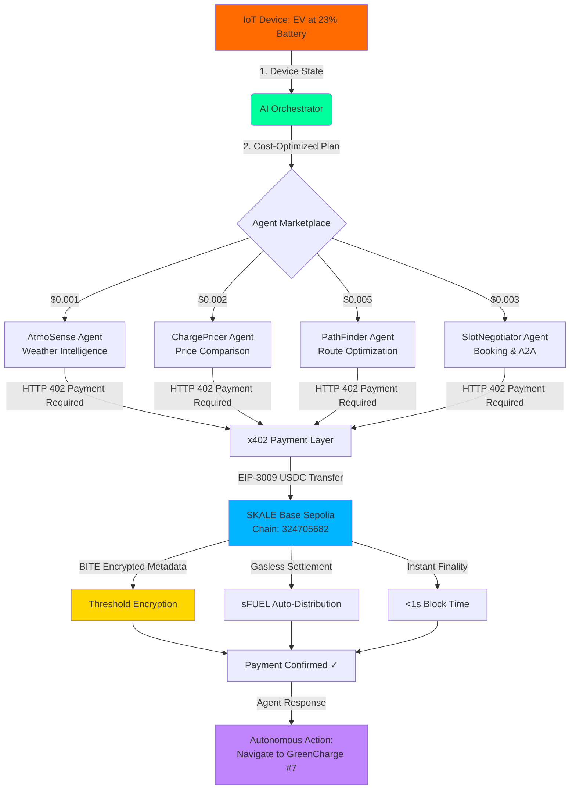

# 🔗 PairAgent — Autonomous IoT Commerce Engine

> **When machines need help, they hire AI agents and pay them.**
> IoT devices autonomously discover, hire, and pay AI agents via x402 micropayments on SKALE Base Sepolia.

[](https://skale.space)
[](https://x402.org)
[](https://skale.space)
[](https://eips.ethereum.org/EIPS/eip-8004)

---

## 🎯 The Problem

3.3 billion IoT devices will need autonomous services by 2030. Today, every device interaction requires human orchestration, API keys, and centralized payment rails. **Machines can't hire help on their own.**

## 💡 The Solution

PairAgent is an **autonomous commerce engine** where IoT devices (EVs, drones, sensors) independently:

1. **Detect** needs (low battery, maintenance required, route optimization)
2. **Discover** AI agents via ERC-8004 identity registry
3. **Hire** the best agents using Google A2A protocol
4. **Pay** them instantly via x402 micropayments on **SKALE Base Sepolia**
5. **Protect** all payment data with **SKALE BITE** threshold encryption

No human in the loop. No API keys. No gas fees. Just machines paying machines.

---

## 🏗️ Architecture

### System Flow



### Technical Stack Deep Dive

```
┌─────────────────────────────────────────────────────────────────────┐
│                         FRONTEND LAYER                              │
│  Next.js 14 App Router • React 18 • TailwindCSS                     │
│  Real-time Activity Feed • Live Agent Status • Payment Analytics    │
└────────────────────────────┬────────────────────────────────────────┘
                             │
                             ▼
┌─────────────────────────────────────────────────────────────────────┐
│                      ORCHESTRATION LAYER                            │
│                                                                     │
│  ┌──────────────────────────────────────────────────────────────┐  │
│  │  AI Decision Engine (GPT-4o-mini)                            │  │
│  │  • Analyzes: Battery, Location, Schedule, Wallet Balance    │  │
│  │  • Optimizes: Cost vs Time vs Quality tradeoffs             │  │
│  │  • Plans: Sequential agent hiring with data passing         │  │
│  │  • Fallback: Rule-based orchestration (no API key needed)   │  │
│  └──────────────────────────────────────────────────────────────┘  │
│                                                                     │
│  Scenarios: Low Battery Charging • Scheduled Maintenance            │
│             Fleet Repositioning • Emergency Route Reroute           │
└────────────────────────────┬────────────────────────────────────────┘
                             │ Google A2A Protocol
                             ▼
┌─────────────────────────────────────────────────────────────────────┐
│                        AGENT MARKETPLACE                            │
│                                                                     │
│  ERC-8004 Identity Registry  │  Reputation Score  │  Capabilities   │
│  ───────────────────────────────────────────────────────────────   │
│  AtmoSense      • 0x7a8f... │      ★ 4.8         │  Weather Forecast │
│  ChargePricer   • 0x3b2c... │      ★ 4.9         │  Price Oracle     │
│  PathFinder     • 0x9e1d... │      ★ 4.7         │  Route Planning   │
│  SlotNegotiator • 0x4f6a... │      ★ 4.6         │  A2A Negotiation  │
│                                                                     │
│  Each agent = Autonomous API with x402 payment gate                 │
└────────────────────────────┬────────────────────────────────────────┘
                             │ x402 HTTP 402 Flow
                             ▼
┌─────────────────────────────────────────────────────────────────────┐
│                     x402 PAYMENT MIDDLEWARE                         │
│                                                                     │
│  1. Agent API returns HTTP 402 Payment Required                     │
│  2. Device signs EIP-3009 TransferWithAuthorization                 │
│  3. x402 Facilitator verifies signature + funds                     │
│  4. USDC transfer settled on SKALE Base Sepolia                     │
│  5. Facilitator returns payment proof                               │
│  6. Original request retried with payment proof header              │
│  7. Agent executes service + returns result                         │
│                                                                     │
│  All in ~200ms • Zero gas fees • BITE-encrypted metadata            │
└────────────────────────────┬────────────────────────────────────────┘
                             │
                             ▼
┌─────────────────────────────────────────────────────────────────────┐
│              🌐 SKALE BASE SEPOLIA (CHAIN: 324705682)               │
│                                                                     │
│  Consensus: Proof of Stake (gasless execution)                      │
│  Block Time: <1 second                                              │
│  Gas Model: sFUEL (free, auto-distributed)                          │
│  USDC: 0x2e08028E3C4c2356572E096d8EF835cD5C6030bD (EIP-3009)        │
│  RPC: https://base-sepolia-testnet.skalenodes.com/v1/...            │
│  Explorer: base-sepolia-testnet.explorer.skalenodes.com             │
│                                                                     │
│  🔐 BITE PROTOCOL (Blockchain Integrated Threshold Encryption)      │
│  ├─ Pre-Mempool: Payment metadata encrypted via threshold scheme   │
│  ├─ In-Block: Encrypted tx data stored on-chain                    │
│  └─ Post-Finalization: Decryption keys distributed, data revealed  │
│                                                                     │
│  Why? Prevents MEV bots from:                                       │
│  • Frontrunning EV charging station reservations                    │
│  • Analyzing device payment patterns to infer location/behavior     │
│  • Extracting commercial IoT usage data from public mempool         │
└────────────────────────────┬────────────────────────────────────────┘
                             │
                             ▼
┌─────────────────────────────────────────────────────────────────────┐
│                   IDENTITY & AUTHORIZATION LAYER                    │
│                                                                     │
│  📋 ERC-8004 (Agent Identity Standard)                              │
│     • Identity Registry: On-chain agent metadata                    │
│     • Reputation Tracking: Performance scores across networks       │
│     • Validation Registry: Proof of capability (ZK, attestations)   │
│                                                                     │
│  🔑 AP2 Intent Mandates (Authorization Protocol 2.0)                │
│     • Pre-authorized spending: "Spend up to $5/day on charging"    │
│     • Conditional execution: "Only if price < $0.15/kWh"           │
│     • Multi-agent workflows: "Book slot only after route confirmed" │
│     • Revocable permissions: Owner can halt device spending         │
│                                                                     │
│  📡 Pairpoint by Vodafone (IoT Device Identity)                     │
│     • SIM-based authentication: Device identity tied to eSIM        │
│     • Network-level security: Carrier-grade PKI                     │
│     • Global roaming: Works across 200+ countries                   │
│     • Anti-cloning: Hardware-backed secure element                  │
└─────────────────────────────────────────────────────────────────────┘
```

---

## ⚡ Why SKALE?

PairAgent runs on **SKALE Base Sepolia** because IoT micropayments need:

| Feature | Why It Matters for IoT |
|---------|----------------------|
| **Zero Gas Fees** | A $0.001 weather query can't cost $0.50 in gas. SKALE's sFUEL is free. |
| **BITE Encryption** | EV charging patterns reveal location, habits, schedules. BITE encrypts payment metadata pre-mempool. |
| **Instant Finality** | Devices can't wait 12 seconds for confirmation. SKALE confirms in <1 second. |
| **EIP-3009 USDC** | Gasless `TransferWithAuthorization` — the device signs, SKALE handles the rest. |
| **x402 Native** | SKALE Expand on Base is purpose-built for x402 agent workloads. |

---

## 🚀 Quick Start

```bash
# Clone and install
git clone https://github.com/YOUR_USERNAME/pairagent.git
cd pairagent
npm install

# Configure
cp .env.example .env.local
# Edit .env.local with your wallet address

# Run
npm run dev
```

Open [http://localhost:3000](http://localhost:3000) and press **"Run Autonomous Sequence"**.

### What You'll See:

1. 🧠 **Orchestrator** analyzes the EV's state (23% battery, San Francisco)
2. 🌦️ **AtmoSense** hired for weather data → x402 payment: $0.001 USDC
3. ⚡ **ChargePricer** hired for price comparison → x402 payment: $0.002 USDC
4. 🗺️ **PathFinder** hired for route optimization → x402 payment: $0.005 USDC
5. 📅 **SlotNegotiator** hired to book charging slot → x402 payment: $0.003 USDC
6. ✅ EV autonomously found, compared, routed to, and booked a charging slot

**Every agent call = a real x402 micropayment settled on SKALE Base Sepolia.**

---

## 🛠️ Tech Stack

| Layer | Technology | Purpose |
|-------|-----------|---------|
| **Settlement** | **SKALE Base Sepolia** | Gasless, instant, encrypted chain |
| **Payments** | **x402 (Coinbase)** | HTTP-native micropayments |
| **Privacy** | **SKALE BITE** | Threshold encryption for payment metadata |
| **Agent Discovery** | **ERC-8004** | On-chain identity + reputation registry |
| **Agent Comms** | **Google A2A** | Standardized agent-to-agent protocol |
| **Authorization** | **AP2 Intent Mandates** | Spending limits and permission scoping |
| **IoT Identity** | **Pairpoint (Vodafone)** | SIM-based device authentication |
| **AI Brain** | **OpenAI + fallback** | Orchestrator decision engine |
| **Frontend** | **Next.js 14** | Real-time dashboard |

---

## 📁 Project Structure

```
pairagent/
├── middleware.ts              # x402 payment gate (SKALE Base Sepolia)
├── src/
│   ├── app/
│   │   ├── page.tsx           # Dashboard with real-time activity feed
│   │   ├── layout.tsx         # App layout with Space Grotesk font
│   │   ├── globals.css        # Custom animations, grid background
│   │   └── api/
│   │       ├── orchestrate/
│   │       │   └── route.ts   # AI orchestrator — plans which agents to hire
│   │       └── agents/
│   │           ├── weather/route.ts   # AtmoSense — $0.001/call
│   │           ├── pricing/route.ts   # ChargePricer — $0.002/call
│   │           ├── routing/route.ts   # PathFinder — $0.005/call
│   │           └── slot/route.ts      # SlotNegotiator — $0.003/call
│   ├── config/
│   │   ├── agents.ts          # Agent registry configuration
│   │   └── skale.ts           # SKALE Base Sepolia chain config + BITE
│   └── lib/
│       └── x402-client.ts     # x402 payment client wrapper
├── .env.example
├── package.json
└── README.md
```

---

## 🎯 Hackathon Tracks

### 🏆 x402 Track — Agentic Commerce
PairAgent demonstrates the **core x402 vision**: autonomous agents paying each other via HTTP 402 status codes. Every agent API endpoint is gated with `x402-next` middleware. No subscriptions, no API keys — just pay-per-use.

### 🔐 SKALE Encrypted Track — BITE Protocol
IoT payment metadata (which device paid, when, how much, for what service) is sensitive data. SKALE's BITE (Blockchain Integrated Threshold Encryption) encrypts transaction inputs pre-mempool and decrypts post-finalization. This prevents surveillance of EV charging patterns and protects device privacy.

### 📡 Pairpoint / Vodafone Track — IoT Commerce
PairAgent uses Pairpoint SIM-based identity to authenticate IoT devices. Each device has a unique Pairpoint ID that links physical identity (SIM) to on-chain identity (ERC-8004). This bridges the gap between physical IoT devices and autonomous digital commerce.

### 🤖 Google A2A Track — Agent Interoperability
All agent-to-agent communication follows Google's A2A protocol standard, enabling any compliant agent to join the PairAgent ecosystem. The orchestrator uses AP2 Intent Mandates for authorized spending.

### 🆔 ERC-8004 Track — Agent Identity
Each agent is registered with ERC-8004 (Identity + Reputation + Validation registries). Devices verify agent identity and check reputation scores before hiring. Trust is on-chain, not assumed.

---

## 🔄 Demo Scenarios

| Scenario | Trigger | Agents Hired | Total Cost |
|----------|---------|-------------|------------|
| **Low Battery Charge** | Battery < 30% | Weather → Pricing → Routing → Slot | $0.011 |
| **Scheduled Maintenance** | Maintenance interval | Diagnostic → Comparison → Booking | $0.008 |
| **Fleet Optimization** | Demand spike detected | Demand Analysis → Repositioning | $0.007 |

---

## 🔮 Production Roadmap

- **SKALE Base Mainnet** deployment with real USDC settlements
- **Confidential x402** via MachinePay encrypted token standard
- **Multi-device fleet** management with shared agent pools
- **Cross-chain** agent hiring via SKALE Expand on multiple EVM chains
- **Pairpoint integration** with real Vodafone SIM-authenticated devices

---

## 📊 Market Context

- **3.3B** IoT devices projected by 2030 (McKinsey)
- **x402** processed 140M+ test transactions in first month
- **ERC-8004** launched on mainnet 2 weeks ago
- **SKALE** serves 55M+ wallets with zero gas fees
- **$0** gas cost on SKALE vs $0.01-$2.00 on L1/L2 chains

---

## 🏆 Built for SF Agentic Commerce x402 Hackathon

**Feb 11-14, 2026** · San Francisco

Sponsors: SKALE · Google · Coinbase · Virtuals · Edge & Node · Pairpoint by Vodafone

Settlement: **SKALE Base Sepolia Testnet** (Chain ID: 324705682)

---

*PairAgent — Because the future of commerce isn't humans clicking buttons. It's machines hiring machines.*
